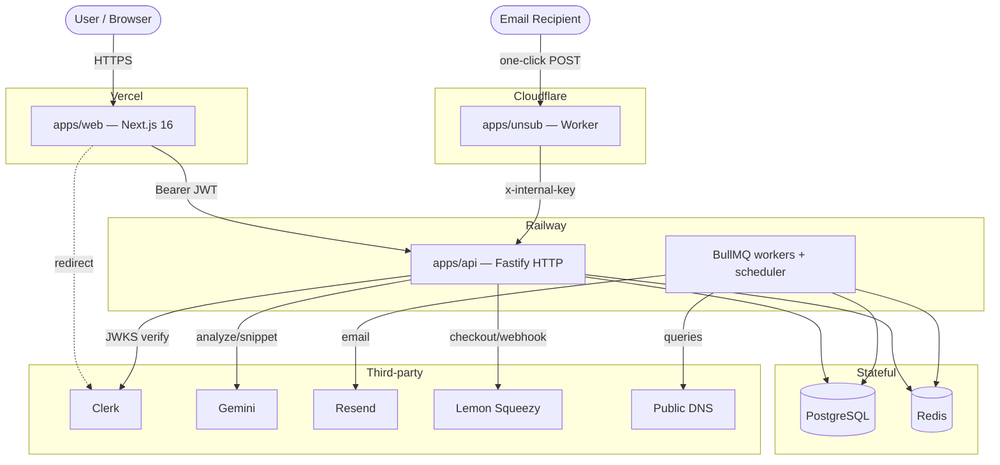
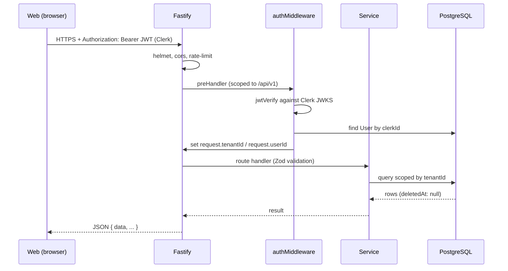

# InboxRules — Technical Documentation

Detailed technical reference for the InboxRules monorepo. For a concise overview and quickstart, see [README.md](./README.md).

This document is generated from inspection of the actual repository. Where a detail could not be determined from the codebase, it is explicitly marked as such.

## Table of Contents

1. [System Overview](#1-system-overview)
2. [Architecture Diagram](#2-architecture-diagram)
3. [Monorepo Structure](#3-monorepo-structure)
4. [Application Responsibilities](#4-application-responsibilities)
5. [Request Lifecycle](#5-request-lifecycle)
6. [Authentication Architecture](#6-authentication-architecture)
7. [Authorization & Tenant Isolation](#7-authorization--tenant-isolation)
8. [Database Architecture](#8-database-architecture)
9. [API Architecture](#9-api-architecture)
10. [API Endpoint Reference](#10-api-endpoint-reference)
11. [Background Processing](#11-background-processing)
12. [DNS Scanning](#12-dns-scanning)
13. [AI Analysis](#13-ai-analysis)
14. [Unsubscribe Architecture](#14-unsubscribe-architecture)
15. [Billing](#15-billing)
16. [Webhooks](#16-webhooks)
17. [Frontend Architecture](#17-frontend-architecture)
18. [UI Components](#18-ui-components)
19. [Error Handling](#19-error-handling)
20. [Logging & Observability](#20-logging--observability)
21. [Security Architecture](#21-security-architecture)
22. [Performance](#22-performance)
23. [Configuration Reference](#23-configuration-reference)
24. [Development Workflow](#24-development-workflow)
25. [Troubleshooting](#25-troubleshooting)
26. [Known Limitations & Tech Debt](#26-known-limitations--tech-debt)
27. [Future Improvements](#27-future-improvements)

---

## 1. System Overview

InboxRules is an email-deliverability monitoring SaaS. It continuously inspects a customer's sending domains for correct email-authentication configuration — SPF, DKIM, DMARC, BIMI, MTA-STS, TLS-RPT — and for RFC 8058 one-click-unsubscribe support. When a domain's DNS configuration changes or drifts out of compliance, the system detects it, classifies the severity, and notifies the customer. An AI layer (Google Gemini) turns raw structured findings into plain-English explanations and ESP-specific fixes. Separately, the platform hosts an RFC 8058 one-click unsubscribe endpoint at the edge so customers can advertise a compliant `List-Unsubscribe-Post` header.

The system is split into three independently deployable applications within a single pnpm workspace:

- **`apps/api`** — the core backend (Fastify + Prisma + BullMQ). Owns all business logic, the database, DNS scanning, AI orchestration, alerting, billing, and the internal unsubscribe endpoint.
- **`apps/web`** — the customer-facing dashboard (Next.js App Router + Clerk).
- **`apps/unsub`** — a Cloudflare Worker that serves the public one-click unsubscribe endpoint at the edge and calls back into the API.

Core design principles observed in the codebase:

- **Layered backend**: `routes → service → db/external`. HTTP concerns stay in routes; business logic lives in services.
- **Multi-tenancy everywhere**: all data is scoped to a `Tenant`; soft-delete via `deletedAt` is the default.
- **Structured-data boundary for AI**: the DNS checker emits only structured types; raw DNS/header strings never reach AI prompts.
- **PII is hashed, not stored raw**: unsubscribe tokens, recipients, and suppression emails are stored as hashes.

## 2. Architecture Diagram



The API and its workers share the same PostgreSQL and Redis instances. In development the workers can run inside the API process; in production they are intended to run as a separate service (see [Background Processing](#11-background-processing)).

## 3. Monorepo Structure

The repository is a pnpm workspace. `pnpm-workspace.yaml` declares a single package glob:

```yaml
packages:
  - "apps/*"
```

There is no shared `packages/` directory and no root-level build/test orchestration — the root `package.json` `test` script is a placeholder. The root declares `packageManager: pnpm@10.33.0` and carries only two dev dependencies (`eslint-plugin-import`, `prisma`).

```
InboxRules/
├── apps/
│   ├── api/     # Fastify backend — the core of the system
│   ├── web/     # Next.js dashboard
│   └── unsub/   # Cloudflare Worker
├── pnpm-workspace.yaml
├── package.json
├── pnpm-lock.yaml
├── CLAUDE.md
└── .gitignore
```

Each app carries its own `package.json` and is built, run, and deployed independently. All commands are run from inside the relevant app directory.

> A stray `web/.next/` directory exists at the repo root. It is leftover build output, not an app; the real frontend is `apps/web`.

## 4. Application Responsibilities

### `apps/api` — backend (Fastify + Prisma + BullMQ)

The system's core. Owns:

- The HTTP API (`/api/v1/*`, webhooks, `/health`, `/internal/*`).
- The PostgreSQL database (via Prisma 7 with a driver adapter).
- DNS scanning (`src/modules/dns-checker`).
- AI orchestration (`src/modules/ai`).
- Alerting, suppression, billing, and analytics modules.
- Background workers and the scheduler (`src/workers`).

Module layout under `src/modules/<name>/`: each module typically has `*.routes.ts` (HTTP), `*.service.ts` (business logic), and `*.schema.ts` (Zod validation). Modules are registered in `src/server.ts`.

### `apps/web` — dashboard (Next.js App Router)

The customer-facing UI. Responsibilities:

- Renders the authenticated dashboard under `app/dashboard/*` and public info pages.
- Handles auth via Clerk middleware; attaches the Clerk JWT as a `Bearer` token on API calls.
- Consumes the API over HTTP (JSON + SSE for AI streaming).

The web app holds **no** business logic or direct database access — it is a pure client of the API.

### `apps/unsub` — edge unsubscribe (Cloudflare Worker)

A standalone Cloudflare Worker (single `src/index.ts`, no Node APIs). Responsibilities:

- Serve the public RFC 8058 one-click unsubscribe endpoint.
- Verify the unsubscribe token's HMAC using `UNSUB_HMAC_SECRET` (shared with the API).
- Call the API's `POST /internal/unsubscribe` with the `INTERNAL_API_KEY` to record the suppression.

## 5. Request Lifecycle

### Authenticated API request (`/api/v1/*`)



1. Fastify applies global plugins: `helmet` (security headers), `cors` (origin-restricted), `rate-limit` (100 req/min per IP).
2. A custom JSON content-type parser stores the raw request body on `request.rawBody` (needed for webhook signature verification).
3. For `/api/v1/*`, `authMiddleware` runs as a `preHandler`, verifying the Clerk JWT and attaching `tenantId`/`userId`.
4. The route handler validates input with Zod, calls a service, and shapes the response.
5. Services query the database scoped by `tenantId` and filtered by `deletedAt: null`.
6. Responses are JSON, typically wrapped as `{ data, ... }`. Unhandled errors are caught by a global error handler returning `{ error: { code: "INTERNAL_ERROR", message, requestId } }` with HTTP 500.

### Public webhook request

Webhook routes (`/webhooks/billing`, `/webhooks/clerk`) are registered **outside** the `/api/v1` scope, so `authMiddleware` does not run. They verify the provider's signature against `request.rawBody`.

### Internal request (from the unsub worker)

`POST /internal/unsubscribe` is registered outside `/api/v1` and authenticates via a static `x-internal-key` header (timing-safe compared to `INTERNAL_API_KEY`).

## 6. Authentication Architecture

Three separate authentication mechanisms, by route class.

### 6.1 User-facing (Clerk JWT via JWKS)

Applies to all `/api/v1/*` routes via `authMiddleware` (`src/middleware/auth.ts`):

- The client sends `Authorization: Bearer <token>`, where the token is a Clerk session JWT.
- The middleware verifies the JWT using Clerk's JWKS endpoint through the `jose` library's `createRemoteJWKSet` + `jwtVerify`. **No Clerk SDK is used** for verification.
- The JWKS set is cached, with a 10-second fetch timeout. `warmJwks()` is called at startup (not awaited) to pre-warm the key set so the first authenticated request doesn't race the cold fetch.
- Verification checks the token **issuer** and authorized party (`azp`); it does not verify an audience claim.
- On success, the middleware looks up the local `User` by `clerkId`, then attaches `request.tenantId` and `request.userId`. This is the tenant-isolation boundary.

### 6.2 Internal (static key)

Applies to `POST /internal/unsubscribe`, called by the unsub worker. The caller sends an `x-internal-key` header, which is compared to `INTERNAL_API_KEY` using a timing-safe comparison. No Clerk involvement.

### 6.3 Webhooks (provider signatures)

- **Lemon Squeezy** (`POST /webhooks/billing`): verifies the `x-signature` header as an HMAC-SHA256 of the raw body using `LEMON_SQUEEZY_WEBHOOK_SECRET`, timing-safe compared.
- **Clerk** (`POST /webhooks/clerk`): verifies the Svix signature headers (`svix-id`, `svix-timestamp`, `svix-signature`) using the `svix` library and `CLERK_WEBHOOK_SECRET`.

### 6.4 Frontend (Clerk middleware)

`apps/web/middleware.ts` uses `clerkMiddleware` + `createRouteMatcher`. Public routes: `/sign-in(.*)`, `/sign-up(.*)`, `/`, `/docs`, `/support`, `/privacy`, `/terms`. Everything else calls `auth.protect()`, redirecting unauthenticated users to sign-in.

## 7. Authorization & Tenant Isolation

Authorization is tenant-scoped rather than role-based in the request path. The `User` model has a `role` field (default `"member"`), but the primary isolation mechanism is the `tenantId` attached by `authMiddleware`:

- Every tenant-owned model carries a `tenantId` column.
- Services query using the caller's `tenantId`; a user can only ever read or mutate rows belonging to their own tenant.
- Soft-deleted rows are excluded by filtering `deletedAt: null`.
- The suppression list route applies a defence-in-depth `tenantId` check in addition to the standard scoping.

**Plan-based authorization** is enforced in services (not middleware):

- **Domain limits** per plan (`domains.service.ts`): free 3, pro 50, agency 500. Exceeding returns `PLAN_LIMIT_REACHED` (403).
- **AI monthly budget** per plan (`ai-quota.ts`): checked before any AI call; exceeding returns 429.
- **Scan frequency** per plan: enforced by the scheduler's poll intervals and billing plan limits.

## 8. Database Architecture

### 8.1 Prisma 7 with driver adapter

- Schema: `apps/api/prisma/schema.prisma`. Datasource provider `postgresql`; generator `prisma-client-js` with `engineType = "client"`.
- `engineType="client"` **requires** a driver adapter. `src/db.ts` constructs a `PrismaPg` adapter (`@prisma/adapter-pg`) from `DATABASE_URL` and passes it to `PrismaClient`.
- The client is a shared singleton (`export default db`), cached on `globalThis.__prisma` in development to survive hot reloads. All code should import this client rather than constructing its own.
- Prisma 7 does not auto-load `.env`; `src/db.ts` imports `dotenv/config`, and the `db:*` scripts run through `dotenv -e .env`.
- Query logging is enabled in development (`["query", "error", "warn"]`), errors-only in production.

### 8.2 Data model

Ten models, all mapped to snake_case table names:

| Model              | Table                | Purpose                                 | Soft-delete       |
| ------------------ | -------------------- | --------------------------------------- | ----------------- |
| `Tenant`           | `tenants`            | Customer account; root of multi-tenancy | Yes (`deletedAt`) |
| `User`             | `users`              | Clerk-linked user belonging to a tenant | Yes               |
| `Domain`           | `domains`            | A monitored sending domain              | Yes               |
| `DnsSnapshot`      | `dns_snapshots`      | Point-in-time DNS scan result           | No                |
| `DnsChangeEvent`   | `dns_change_events`  | Detected change between snapshots       | No                |
| `EmailAnalysis`    | `email_analyses`     | Parsed/analyzed email result            | No                |
| `SuppressionEvent` | `suppression_events` | Recorded unsubscribe/suppression        | No                |
| `UnsubscribeToken` | `unsubscribe_tokens` | Hashed one-click unsubscribe token      | No                |
| `AiUsageLog`       | `ai_usage_logs`      | Per-call AI usage + cost                | No                |
| `AuditLog`         | `audit_logs`         | Tenant action audit trail               | No                |

**Key fields by model:**

- **`Tenant`**: `plan` (default `"free"`), `lsCustomerId` (Lemon Squeezy customer), `notificationChannels` (JSON).
- **`User`**: `clerkId` (unique), `email`, `role` (default `"member"`), `tenantId`.
- **`Domain`**: `domain`, `healthScore` (default 0), status columns `spfStatus`/`dkimStatus`/`dmarcStatus`/`bimiStatus`/`mtaStsStatus`/`tlsRptStatus` (default `"unknown"`), unsubscribe opt-in (`unsubStatus`, `unsubEnabled` default false, `unsubEnabledAt`), `detectedEsp`, `lastCheckedAt`.
- **`DnsSnapshot`**: raw records and parsed fields per mechanism (`spfRecord`, `spfLookupCount`, `spfResult`, `dkimSelectors` JSON, `dmarcRecord`, `dmarcPolicy`, `dmarcPct`, `bimiRecord`/`bimiResult`, `mtaStsRecord`/`mtaStsResult`, `tlsRptRecord`/`tlsRptResult`), `overallScore`, `capturedAt`.
- **`DnsChangeEvent`**: `changeType`, `severity`, `previousValue`/`currentValue`, AI fields (`aiTitle`, `aiSummary`, `aiFixSteps` JSON), `acknowledged`, `resolvedAt`, `detectedAt`.
- **`EmailAnalysis`**: `parsedResult` (JSON), `aiDiagnosis`, `espDetected`, `espConfidence`, `overallScore`, `rawHeadersDeletedAt` (retention marker).
- **`SuppressionEvent`**: `emailHash` (hashed PII), `eventType`, `sourceEsp`, `occurredAt`, `processedAt`.
- **`UnsubscribeToken`**: `tokenHash` (unique), `recipientHash` (both hashed PII), `usedAt`.
- **`AiUsageLog`**: `feature`, `model`, `inputTokens`, `outputTokens`, `costUsd`.
- **`AuditLog`**: `userId`, `action`, `resourceType`, `resourceId`, `metadata` (JSON), `ipAddress`.

### 8.3 Indexes and the partial unique index

Most models carry a composite index `(tenantId, <timestamp> DESC)` to serve tenant-scoped, time-ordered listings. `Domain` has `@@index([tenantId, domain])` and `@@index([tenantId])`.

Uniqueness of `(tenantId, domain)` is **not** declared as `@@unique` in the schema. Prisma cannot express partial indexes, so it is enforced by a raw SQL migration (`20260803000000_domain_partial_unique`) that creates a **partial** unique index scoped to `WHERE "deletedAt" IS NULL`. This lets a soft-deleted domain be re-added later without colliding with its tombstoned row. Re-adding `@@unique([tenantId, domain])` to the schema would cause Prisma to recreate the full unique index and reintroduce that collision.

### 8.4 Migration history (selected)

- **`20260803000000_domain_partial_unique`** — drops the full unique index `domains_tenantId_domain_key`, de-duplicates any existing rows defensively, and creates the partial unique index `domains_tenantId_domain_active_key` scoped to active (non-deleted) rows.
- **`20260806182805`** — adds `Tenant.notificationChannels` (JSONB).
- **`20260807100726`** — adds BIMI/MTA-STS/TLS-RPT fields to `domains`/`dns_snapshots`, plus `unsubEnabled`/`unsubEnabledAt`.

## 9. API Architecture

### 9.1 Server construction

`src/server.ts` builds a single Fastify instance:

1. **Raw-body JSON parser** — replaces the default parser (`parseAs: "string"`) and stashes the exact request bytes on `request.rawBody`. Webhook signature verification needs the exact signed bytes; a re-serialized body would not reliably reproduce key order/whitespace.
2. **`helmet`** — security headers on every response.
3. **`cors`** — origin `true` in development; in production restricted to `FRONTEND_URL` (fallback `https://inboxrules.io`). Methods `GET/POST/PUT/PATCH/DELETE/OPTIONS`; allowed headers `Content-Type`, `Authorization`.
4. **`rate-limit`** — 100 requests/minute per IP. Store is Redis-backed in production (shared across instances) and in-memory in development. `skipOnError: true` fails **open** if Redis is unreachable, so a Redis outage does not take down every endpoint. Over-limit responses use error code `RATE_LIMIT_EXCEEDED`.
5. **`GET /health`** — public liveness endpoint returning `{ status, timestamp, version }`.
6. **`internalSuppressionRoutes`** — registered at root scope (no auth middleware); contains only `POST /internal/unsubscribe`.
7. **Protected scope** (`prefix: "/api/v1"`) — registers `authMiddleware` as a `preHandler`, then mounts the module routers: `/domains`, `/ai`, `/suppression`, `/alerts`, `/billing`, `/analytics`.
8. **Webhook routers** — `billingWebhookRoutes` and `clerkWebhookRoutes`, registered outside `/api/v1`.
9. **Global error handler** — logs the error with `requestId`/`url`/`method` and returns HTTP 500 `{ error: { code: "INTERNAL_ERROR", message, requestId } }`.

### 9.2 Response envelope

Successful responses are JSON wrapped as `{ data, ... }`, often with a `message` and/or `pagination` block. Errors are `{ error: { code, message, details? } }`. Cursor pagination returns `{ pagination: { hasNextPage, nextCursor, total } }`.

### 9.3 Module layout

Each module under `src/modules/<name>/` follows `routes → service → db/external`:

- `*.routes.ts` — Fastify handlers: Zod validation, status codes, error shaping.
- `*.service.ts` — business logic and database access (scoped by `tenantId`).
- `*.schema.ts` — Zod schemas for request validation.

## 10. API Endpoint Reference

All `/api/v1/*` endpoints require a valid Clerk Bearer JWT. All responses follow the envelope in §9.2.

### 10.1 Health (public)

| Method | Path      | Description                                               |
| ------ | --------- | --------------------------------------------------------- |
| GET    | `/health` | Liveness check. Returns `{ status, timestamp, version }`. |

### 10.2 Domains (`/api/v1/domains`)

| Method | Path                       | Success | Notable errors                                                                |
| ------ | -------------------------- | ------- | ----------------------------------------------------------------------------- |
| POST   | `/`                        | 201     | 400 `VALIDATION_ERROR`, 409 `DOMAIN_ALREADY_EXISTS`, 403 `PLAN_LIMIT_REACHED` |
| GET    | `/`                        | 200     | 400 `VALIDATION_ERROR`                                                        |
| GET    | `/:id`                     | 200     | 400 `INVALID_DOMAIN_ID`, 404 `DOMAIN_NOT_FOUND`                               |
| POST   | `/:id/scan`                | 202     | 404 `DOMAIN_NOT_FOUND`, 503 `QUEUE_UNAVAILABLE` (with `Retry-After: 30`)      |
| DELETE | `/:id`                     | 200     | 404 `DOMAIN_NOT_FOUND` (soft-delete)                                          |
| POST   | `/:id/unsubscribe/enable`  | 200     | 404 `DOMAIN_NOT_FOUND`                                                        |
| POST   | `/:id/unsubscribe/disable` | 200     | 404 `DOMAIN_NOT_FOUND`                                                        |
| GET    | `/:id/unsubscribe/headers` | 200     | 400 `VALIDATION_ERROR`, 403 `UNSUBSCRIBE_NOT_ENABLED`, 404 `DOMAIN_NOT_FOUND` |

- **`GET /`** query params: `limit`, `cursor`, `status`, `include` (validated by `ListDomainsSchema`).
- **`POST /`** body: `{ domain }` (validated/normalized by `AddDomainSchema` — trimmed, lowercased, format-checked).
- **`GET /:id/unsubscribe/headers`** query param: `recipient` (a real recipient email is required; the token encodes `domainId:recipient`). Returns `{ listUnsubscribe, listUnsubscribePost }`.

### 10.3 AI (`/api/v1/ai`)

| Method | Path       | Success          | Notable errors                                  |
| ------ | ---------- | ---------------- | ----------------------------------------------- |
| POST   | `/analyze` | 200 (SSE stream) | 400 `VALIDATION_ERROR`, 429 `AI_QUOTA_EXCEEDED` |
| POST   | `/snippet` | 200              | 400 `VALIDATION_ERROR`, 429 `AI_QUOTA_EXCEEDED` |

- **`POST /analyze`** body: `{ domain }`. Quota is checked **before** the SSE stream opens (so an over-quota tenant gets a clean 429 rather than a half-open stream). The stream emits: `event: dns_result` (structured DNS check), repeated `event: ai_token` (`{ token }`), then `event: done` (`{}`); on failure `event: error` (`{ message }`).
- **`POST /snippet`** body: `{ esp, domain, unsubscribeUrl, useCase }` where `useCase ∈ {marketing, transactional, cold_outreach}` (default `marketing`).

### 10.4 Suppression (`/api/v1/suppression`)

| Method | Path | Success | Description                                                                                                                          |
| ------ | ---- | ------- | ------------------------------------------------------------------------------------------------------------------------------------ |
| GET    | `/`  | 200     | List suppression events. Query: `limit` (max 100), `cursor`, `domainId`. Fails closed (401 `UNAUTHORIZED`) if `tenantId` is missing. |

### 10.5 Alerts (`/api/v1/alerts`)

| Method | Path               | Success                      | Description                                                                                                               |
| ------ | ------------------ | ---------------------------- | ------------------------------------------------------------------------------------------------------------------------- |
| GET    | `/`                | 200                          | List change events. Query: `status` (`unresolved`/`resolved`/`all`), `severity`, `domainId`, `limit` (max 100), `cursor`. |
| GET    | `/:id`             | 200 / 404 `ALERT_NOT_FOUND`  | Single alert with domain detail.                                                                                          |
| POST   | `/:id/acknowledge` | 200 / 404                    | Mark acknowledged; writes an `AuditLog`.                                                                                  |
| POST   | `/:id/resolve`     | 200 / 404                    | Mark acknowledged + `resolvedAt`; writes an `AuditLog`.                                                                   |
| GET    | `/channels`        | 200 / 404 `TENANT_NOT_FOUND` | Read notification channels (defaults if never set).                                                                       |
| PUT    | `/channels`        | 200                          | Merge-update channels; writes an `AuditLog`.                                                                              |
| POST   | `/channels/test`   | 200 / 400 `TEST_FAILED`      | Send a test notification. Body: `{ channel: email\|slack\|webhook, destination }`.                                        |

### 10.6 Billing (`/api/v1/billing`)

| Method | Path        | Success                     | Description                                                                                |
| ------ | ----------- | --------------------------- | ------------------------------------------------------------------------------------------ |
| GET    | `/`         | 200                         | Current subscription + usage metrics.                                                      |
| POST   | `/checkout` | 200 / 400 `INVALID_PLAN`    | Create a Lemon Squeezy checkout. Body: `{ plan: pro\|agency }`. Returns `{ checkoutUrl }`. |
| POST   | `/portal`   | 200 / 400 `NO_SUBSCRIPTION` | Get customer portal URL. Returns `{ portalUrl }`.                                          |
| GET    | `/usage`    | 200                         | Detailed usage metrics for the current month.                                              |

### 10.7 Analytics (`/api/v1/analytics`)

| Method | Path                  | Success   | Description                                                        |
| ------ | --------------------- | --------- | ------------------------------------------------------------------ |
| GET    | `/health-history`     | 200 / 400 | Daily average health score. Query: `period ∈ {7,30,90}`.           |
| GET    | `/overview`           | 200 / 400 | KPIs with previous-period comparison. Query: `period ∈ {7,30,90}`. |
| GET    | `/compliance-summary` | 200       | Per-signal pass counts across the tenant's domains.                |

### 10.8 Internal (root scope, `x-internal-key`)

| Method | Path                    | Auth                                                 | Description                                                                                                                                                                   |
| ------ | ----------------------- | ---------------------------------------------------- | ----------------------------------------------------------------------------------------------------------------------------------------------------------------------------- |
| POST   | `/internal/unsubscribe` | `x-internal-key` == `INTERNAL_API_KEY` (timing-safe) | Record a suppression from the unsub worker. Body: `{ token, method, processedAt }`. Idempotent; returns 200 even for unknown tokens (does not reveal which tokens are valid). |

### 10.9 Webhooks (public, signature-verified)

| Method | Path                | Verification                                                                                                                        |
| ------ | ------------------- | ----------------------------------------------------------------------------------------------------------------------------------- |
| POST   | `/webhooks/billing` | Lemon Squeezy `x-signature` HMAC-SHA256 of raw body (timing-safe); `x-event-name` header. Responds 200 immediately, then processes. |
| POST   | `/webhooks/clerk`   | Clerk/Svix signature headers (`svix-id`, `svix-timestamp`, `svix-signature`).                                                       |

## 11. Background Processing

### 11.1 Queues (BullMQ + Redis)

Defined in `src/queue.ts`:

| Queue            | Job payload                           | Retry policy                                   | Retention                            |
| ---------------- | ------------------------------------- | ---------------------------------------------- | ------------------------------------ |
| `dns-poll`       | `{ domainId, tenantId, triggeredBy }` | 3 attempts, exponential backoff 5s → 10s → 20s | keep last 100 completed / 500 failed |
| `alert-dispatch` | `{ changeEventId, tenantId }`         | 3 attempts, exponential backoff from 2s        | keep last 50 completed / 200 failed  |

### 11.2 Workers

Entry point `src/workers/index.ts` starts both workers and the scheduler.

- **`dns-poll.worker.ts`** — concurrency 5. Runs `runAndSaveScan()` for the domain, then finds change events detected within the last ~5 minutes and enqueues `alert-dispatch` jobs (with a deterministic `jobId` for dedup).
- **`alert-dispatch.worker.ts`** — concurrency 2. Sends the alert email via Resend, generating an AI explanation first if the change event lacks one (`explainDnsChange`). The email HTML template is inline. Sends to the domain owner, or any tenant user as fallback.

### 11.3 Scheduler

`src/workers/scheduler.ts` runs on a 5-minute `setInterval`:

- **Poll intervals by plan**: free 24h, pro 6h, agency 1h (`POLL_INTERVALS`).
- Finds domains due for a rescan (`lastCheckedAt` null or older than the plan cutoff) and enqueues `dns-poll` jobs with `jobId = scheduled-scan-${domain.id}` so BullMQ deduplicates overlapping runs.
- **Weekly reports**: on Mondays between ~09:00–09:05, a Redis `SET NX` marker (`weekly-report:sent:${isoWeekKey}`, `EX` ~8 days) ensures the weekly report is enqueued at most once per ISO week.

### 11.4 Execution model

By default, workers do **not** run inside the HTTP process. `src/server.ts` starts them inline only when `RUN_WORKERS_INLINE === "true"`. Otherwise, run `pnpm workers` as a separate process (the intended production topology). Running the API, workers, and scheduler all against a single rate-limited Redis (e.g. Upstash free tier) can exhaust its per-command budget, which is why inline execution is opt-in.

## 12. DNS Scanning

`src/modules/dns-checker/dns.service.ts` is the domain core. `checkDomain()` runs the mechanism checks in parallel and returns **structured** results only (`dns.types.ts`) — never raw DNS strings passed onward to AI.

- **Mechanisms checked**: SPF, DKIM, DMARC, BIMI, MTA-STS, TLS-RPT.
- **Query timeout**: each DNS TXT lookup is bounded at 5 seconds (`resolveTxtWithTimeout`).
- **SPF**: enforces the 10-DNS-lookup limit (`SPF_LOOKUP_LIMIT = 10`); exceeding it is a critical finding.
- **DKIM**: probes a list of ~17 common selectors (`COMMON_DKIM_SELECTORS`).
- **ESP detection**: `detectEsp()` infers the sending provider from SPF includes and DKIM selectors.
- **Health score**: `calculateHealthScore()` weights SPF (30), DKIM (25), DMARC (30), BIMI (5), MTA-STS (8), TLS-RPT (7), deducting for soft failures.

### Change detection

`runAndSaveScan()` (in `domains.service.ts`) writes a new `DnsSnapshot` and compares it against the previous snapshot to emit `DnsChangeEvent`s. Observed change types and severities include:

- `spf_lookup_exceeded` — critical
- `spf_record_changed` — warning
- `dmarc_policy_weakened` — critical
- `dmarc_record_removed` — critical

A best-effort `dns-poll` job is also enqueued as part of the flow.

## 13. AI Analysis

`src/modules/ai/` wraps Google Gemini behind a shared system instruction.

- **Client & model** (`gemini.ts`): `@google/genai` `GoogleGenAI`, model `gemini-2.0-flash`, temperature 0.3, `maxOutputTokens` 2048, with a shared `SYSTEM_INSTRUCTION`.
- **Structured-data boundary**: prompts are built from the DNS checker's structured output. Raw DNS records and email headers are never inserted into prompts — this is a prompt-injection safeguard.
- **Streaming**: `analyzeEmailHeaders()` yields tokens consumed by the `/ai/analyze` SSE route.
- **Snippet generation** (`snippet-generator.ts`): template-first for known ESPs (sendgrid, mailgun, google_workspace, amazon_ses, microsoft_365, postmark, brevo); falls back to AI only when no template matches, gated by `assertAiQuota`.
- **Usage logging**: every call is recorded to `AiUsageLog` (`feature`, `model`, `inputTokens`, `outputTokens`, `costUsd`).

### AI quota

`ai-quota.ts` enforces a per-tenant **monthly USD budget**: free `$0.50`, pro `$10`, agency `$50` (`MONTHLY_AI_BUDGET_USD`). `assertAiQuota()` sums `AiUsageLog.costUsd` for the current calendar month and throws `AiQuotaExceededError` (→ HTTP 429) when the budget is exceeded. On a database error the check **fails open** (allows the call) to avoid blocking the product on a transient DB issue.

## 14. Unsubscribe Architecture

Two cooperating pieces implement RFC 8058 one-click unsubscribe.

### 14.1 Token generation (API)

`suppression.service.ts`:

- `generateUnsubscribeToken()` = HMAC-SHA256 of `${domainId}:${email}` keyed by `UNSUB_HMAC_SECRET`.
- Stored as `UnsubscribeToken` with `tokenHash` + `recipientHash` (SHA-256) — the raw token and email are never stored.
- The unsubscribe URL is `${UNSUB_WORKER_URL || "https://unsub.inboxrules.io"}/unsubscribe/${token}`.
- The `List-Unsubscribe-Post` header value is `List-Unsubscribe=One-Click`.

### 14.2 Edge worker (`apps/unsub`)

Cloudflare Worker (`src/index.ts`), no Node APIs:

- **`POST /unsubscribe/:token`** — the RFC 8058 one-click path. Verifies the body contains `List-Unsubscribe=One-Click`, validates the token format (64-char hex), and calls the API's `POST /internal/unsubscribe` with the `x-internal-key`, bounded by a 5-second `AbortController` timeout (headroom within RFC 8058's 10-second budget). Response branches on `Accept: text/html`.
- **`GET /unsubscribe/:token`** — a manual confirmation page only. Per RFC 8058 §3.2, a GET must not perform the unsubscribe; the page's form POSTs back to the same URL.
- **`GET /health`** and CORS `OPTIONS` handling.

### 14.3 Recording the suppression (API)

`POST /internal/unsubscribe` (see §10.8) hashes the incoming token, looks up the `UnsubscribeToken`, marks it `usedAt` (idempotent), and creates a `SuppressionEvent` using the stored `recipientHash`. Unknown tokens still return 200 to avoid revealing which tokens are valid.

## 15. Billing

Billing uses **Lemon Squeezy** (not Stripe) via its REST API and signed webhooks (`billing.service.ts`, `billing.routes.ts`).

- **API base**: `https://api.lemonsqueezy.com/v1`.
- **Plans**: `free` / `pro` / `agency`, stored on `Tenant.plan`. `Tenant.lsCustomerId` links the Lemon Squeezy customer.
- **Variant IDs**: `LS_PRO_VARIANT_ID`, `LS_AGENCY_VARIANT_ID` select the checkout product.
- **Checkout**: `POST /billing/checkout` (`plan ∈ {pro, agency}`) returns a hosted checkout URL.
- **Portal**: `POST /billing/portal` returns the customer portal URL (400 `NO_SUBSCRIPTION` if none).
- **Usage metrics**: `getUsageMetrics()` counts current-month usage. Plan check limits (`PLAN_LIMITS.checksPerDay`): free 1, pro 4, agency 24.

### Webhook events

`POST /webhooks/billing` verifies the signature, **responds 200 immediately**, then processes the event asynchronously (so Lemon Squeezy does not time out and retry). Handled events include `subscription_created`, `subscription_updated`, and `subscription_payment_failed`.

## 16. Webhooks

Two inbound webhook endpoints, both public (outside `/api/v1`) and both signature-verified against `request.rawBody`.

| Endpoint                 | Provider      | Signature                                                              | Headers                                       |
| ------------------------ | ------------- | ---------------------------------------------------------------------- | --------------------------------------------- |
| `POST /webhooks/billing` | Lemon Squeezy | HMAC-SHA256 of raw body vs `LEMON_SQUEEZY_WEBHOOK_SECRET`, timing-safe | `x-signature`, `x-event-name`                 |
| `POST /webhooks/clerk`   | Clerk (Svix)  | Svix signature verification with `CLERK_WEBHOOK_SECRET`                | `svix-id`, `svix-timestamp`, `svix-signature` |

The Lemon Squeezy handler acknowledges (200) before processing. Both rely on the raw-body parser configured in `src/server.ts` — re-serializing the JSON would break signature verification.

## 17. Frontend Architecture

`apps/web` is a Next.js 16.2.6 App Router application (React 19), built with Turbopack.

### 17.1 Routes

Verified from the App Router tree and production build output:

| Route                                     | Access    | Purpose                   |
| ----------------------------------------- | --------- | ------------------------- |
| `/`                                       | Public    | Landing page              |
| `/sign-in/[[...sign-in]]`                 | Public    | Clerk sign-in (catch-all) |
| `/sign-up/[[...sign-up]]`                 | Public    | Clerk sign-up (catch-all) |
| `/docs`, `/support`, `/privacy`, `/terms` | Public    | Informational pages       |
| `/dashboard`                              | Protected | Dashboard home            |
| `/dashboard/domains`                      | Protected | Domain management         |
| `/dashboard/alerts`                       | Protected | Alerts feed               |
| `/dashboard/analytics`                    | Protected | Analytics/charts          |
| `/dashboard/compliance`                   | Protected | Compliance breakdown      |
| `/dashboard/billing`                      | Protected | Plan & billing            |
| `/dashboard/settings`                     | Protected | Notification channels     |
| `/dashboard/unsubscribe`                  | Protected | Unsubscribe / suppression |

### 17.2 Auth & layout

- `middleware.ts` uses `clerkMiddleware` + `createRouteMatcher`; only `/`, `/sign-in(.*)`, `/sign-up(.*)`, `/docs`, `/support`, `/privacy`, `/terms` are public. Everything else calls `auth.protect()`.
- `app/layout.tsx` wraps the app in `ClerkProvider`, sets fonts (Plus Jakarta Sans + JetBrains Mono), a `ThemeProvider` (`next-themes`, `attribute="class"`, `defaultTheme="light"`, `enableSystem={false}`), and a `Toaster` (`sonner`).
- `next.config.ts` is minimal: it configures `images.remotePatterns` for Clerk's CDN (`img.clerk.com`, `images.clerk.dev`). No `vercel.json`/`vercel.ts` is present.

### 17.3 Data fetching

- All reads go through the `useApiQuery<T>(path)` hook (`lib/useApiQuery.ts`). It attaches the Clerk token as a `Bearer` header, calls `${NEXT_PUBLIC_API_URL}/api/v1${path}`, and unwraps `json.data ?? json`.
- A module-level pub/sub (`refreshAllQueries()` + `useSyncExternalStore`) lets a mutation anywhere refresh every mounted query without a full reload. There is no caching, deduplication, or retry layer.
- `apiRequest(path, method, token, body?)` is the imperative helper for mutations.
- **SSE analysis** (streaming `/ai/analyze`) is implemented directly in `components/dashboard/AddDomainWizard.tsx` using `fetch` + a manual stream reader that splits on `\n\n` — because `EventSource` cannot send an `Authorization` header.

### 17.4 Dependency notes

- `recharts` is installed but not used for the dashboard charts — charts are hand-built. (See [Known Limitations](#26-known-limitations--tech-debt).)
- `lib/api.ts` (containing an alternate `useApi` hook and a `streamAnalysis` helper) is present but **not imported anywhere** — it is dead code; the live SSE logic lives in `AddDomainWizard.tsx`.
- `axios` is listed as a dependency; the verified data-fetching path (`useApiQuery`/`apiRequest`) uses the native `fetch` API.

## 18. UI Components

Styling uses Tailwind CSS v4 with shadcn-style primitives (Radix UI under the hood).

- **`components/ui/`** — primitives: `alert-dialog`, `badge`, `button`, `card`, `dialog`, `dropdown-menu`, `input`, `skeleton`, `sonner` (toasts), `switch`, `table`.
- **`components/dashboard/`** — feature components:
  - `DashboardShell` — layout wrapper (header + scrollable content + footer).
  - `Header`, `Sidebar`, `Footer` — chrome. Footer links to `/docs`, `/support`, `/privacy`, `/terms`.
  - `AddDomainWizard` — add-domain flow, including the live SSE analysis stream.
  - `DomainTable`, `AlertsFeed`, `ComplianceBreakdown`, `HealthChart`, `StatCards` — data displays.

## 19. Error Handling

### Backend

- **Validation**: routes use Zod `safeParse`; failures return 400 with `{ error: { code: "VALIDATION_ERROR", message, details } }`.
- **Domain errors**: mapped to specific codes/statuses — e.g. `DOMAIN_ALREADY_EXISTS` (409), `PLAN_LIMIT_REACHED` (403), `DOMAIN_NOT_FOUND` (404), `QUEUE_UNAVAILABLE` (503 + `Retry-After`), `AI_QUOTA_EXCEEDED` (429), `RATE_LIMIT_EXCEEDED` (429).
- **Unhandled errors**: caught by the global Fastify error handler, logged with `requestId`, returned as 500 `INTERNAL_ERROR` with the `requestId` (internal details never leaked to the client).
- **SSE errors**: once the stream is open, an error is emitted as an `event: error` frame (the HTTP status is already 200), so quota checks happen before the stream opens.
- **Fail-open choices**: the rate limiter (`skipOnError`) and the AI quota check both fail open on infrastructure errors to avoid taking the product down on a transient dependency failure.

### Frontend

- `useApiQuery` captures errors into an `error` string and surfaces them to components; toasts are shown via `sonner`.

## 20. Logging & Observability

- **API logging**: Fastify's built-in `pino` logger. In development it uses `pino-pretty`; in production it emits structured JSON. The global error handler logs `err`, `requestId`, `url`, `method`.
- **Sensitive-data redaction**: a `redact()` helper (`src/lib/redact.ts`) is used when logging errors from AI paths.
- **Health check**: `GET /health` returns `{ status, timestamp, version }` (used by Railway).
- **AI usage tracking**: every AI call is persisted to `AiUsageLog` with token counts and `costUsd`, enabling per-tenant cost analytics and quota enforcement.
- **Audit trail**: `AuditLog` records tenant actions (e.g. `alert.acknowledged`, `alert.resolved`, `alert.channels_updated`) with `userId`, `resourceType`, `resourceId`, and metadata.
- **Startup logging**: `src/db.ts` logs Prisma queries in development. There is no third-party APM/error-tracking integration in the repository. **Metrics/tracing beyond the above are not documented in the repository.**

## 21. Security Architecture

- **Transport & headers**: `helmet` applies security headers to every API response; CORS is origin-restricted in production (`FRONTEND_URL`).
- **AuthN/AuthZ**: Clerk JWT verification via JWKS (issuer + `azp` checked); tenant isolation enforced on every query via `request.tenantId`; internal endpoint gated by a timing-safe `x-internal-key` comparison; webhooks verified by provider signatures against the raw body.
- **PII minimization**: recipient emails and unsubscribe tokens are stored only as SHA-256 hashes (`recipientHash`, `tokenHash`); suppression uses `emailHash`; `EmailAnalysis.rawHeadersDeletedAt` tracks raw-header retention.
- **Prompt-injection boundary**: only structured DNS data reaches AI prompts — never raw DNS records or email headers.
- **Rate limiting**: 100 req/min per IP (Redis-backed in production).
- **Secret handling**: secrets come from environment variables (`.env`, `.env.local`) and `wrangler secret put` for the worker; the unsub `wrangler.toml` explicitly keeps secrets out of the file.
- **Idempotent/non-revealing unsubscribe**: `POST /internal/unsubscribe` returns 200 even for unknown tokens, so it does not reveal which tokens are valid, and is idempotent on already-used tokens.
- **Rich unsubscribe URL default**: when `UNSUB_WORKER_URL` is unset, the token URL falls back to `https://unsub.inboxrules.io`.

## 22. Performance

Performance-relevant choices observed in the code:

- **Parallel DNS checks**: `checkDomain()` runs all mechanism lookups concurrently; each TXT query is capped at 5 seconds so one slow resolver cannot stall a scan.
- **Bounded external calls**: the unsub worker's call to the API uses a 5-second `AbortController` timeout to stay within RFC 8058's 10-second budget.
- **Worker concurrency**: `dns-poll` runs at concurrency 5, `alert-dispatch` at concurrency 2.
- **Job deduplication**: the scheduler uses deterministic `jobId`s so overlapping scans collapse into one job.
- **Rate-limit store**: in-memory in development (avoids a Redis round-trip per request), Redis-backed in production (shared across instances).
- **Prisma client reuse**: a single cached client (`globalThis.__prisma`) avoids exhausting connections during dev hot reloads.
- **Indexing**: composite `(tenantId, <timestamp> DESC)` indexes back the tenant-scoped, time-ordered list queries; the partial unique index on `domains` keeps domain uniqueness enforced without blocking re-adds.
- **Frontend**: most dashboard routes are prerendered as static content (per the build output) and hydrate to client components that fetch data at runtime.

No load testing, benchmark results, or explicit performance budgets are documented in the repository.

## 23. Configuration Reference

Values must never be committed. The following are the variable **names** used by each app.

### 23.1 `apps/api` (`.env`)

| Variable                       | Purpose                                                                                       |
| ------------------------------ | --------------------------------------------------------------------------------------------- |
| `DATABASE_URL`                 | PostgreSQL connection string (used by the Prisma driver adapter).                             |
| `REDIS_URL`                    | Redis connection (BullMQ + rate limit). An Upstash `rediss://` URL enables TLS automatically. |
| `PORT`                         | HTTP port (default `4500`).                                                                   |
| `NODE_ENV`                     | Environment; toggles CORS, rate-limit store, logging, and query logging.                      |
| `FRONTEND_URL`                 | Allowed CORS origin in production.                                                            |
| `RUN_WORKERS_INLINE`           | If `"true"`, run workers + scheduler inside the HTTP process (default off).                   |
| `CLERK_PUBLISHABLE_KEY`        | Clerk publishable key.                                                                        |
| `CLERK_SECRET_KEY`             | Clerk secret key.                                                                             |
| `CLERK_WEBHOOK_SECRET`         | Verifies Clerk (Svix) webhooks.                                                               |
| `CLERK_JWKS_URL`               | Clerk JWKS endpoint for JWT verification.                                                     |
| `CLERK_DOMAIN`                 | Clerk domain (issuer/JWKS derivation).                                                        |
| `GEMINI_API_KEY`               | Google Gemini API key.                                                                        |
| `RESEND_API_KEY`               | Resend API key (alert/report email).                                                          |
| `RESEND_FROM_EMAIL`            | From-address for outbound email.                                                              |
| `LEMON_SQUEEZY_API_KEY`        | Lemon Squeezy REST API key.                                                                   |
| `LEMON_SQUEEZY_STORE_ID`       | Lemon Squeezy store ID.                                                                       |
| `LEMON_SQUEEZY_WEBHOOK_SECRET` | Verifies Lemon Squeezy webhooks.                                                              |
| `LS_PRO_VARIANT_ID`            | Checkout variant for the pro plan.                                                            |
| `LS_AGENCY_VARIANT_ID`         | Checkout variant for the agency plan.                                                         |
| `UNSUB_HMAC_SECRET`            | HMAC key for unsubscribe tokens (≥32 chars; must match the worker).                           |
| `UNSUB_WORKER_URL`             | Base URL of the unsub worker (default `https://unsub.inboxrules.io`).                         |
| `INTERNAL_API_KEY`             | Shared secret for `/internal/*` (must match the worker).                                      |

### 23.2 `apps/web` (`.env.local`)

| Variable                              | Purpose                                                |
| ------------------------------------- | ------------------------------------------------------ |
| `NEXT_PUBLIC_API_URL`                 | Base URL of the API (default `http://localhost:4500`). |
| `CLERK_SECRET_KEY`                    | Clerk secret key (server side).                        |
| `NEXT_PUBLIC_CLERK_PUBLISHABLE_KEY`   | Clerk publishable key (client side).                   |
| `NEXT_PUBLIC_CLERK_SIGN_IN_URL`       | Sign-in route.                                         |
| `NEXT_PUBLIC_CLERK_SIGN_UP_URL`       | Sign-up route.                                         |
| `NEXT_PUBLIC_CLERK_AFTER_SIGN_IN_URL` | Post-sign-in redirect.                                 |
| `NEXT_PUBLIC_CLERK_AFTER_SIGN_UP_URL` | Post-sign-up redirect.                                 |

### 23.3 `apps/unsub` (Wrangler)

`wrangler.toml` sets `name = "inboxrules-unsub"`, `main = "src/index.ts"`, `compatibility_date = "2024-01-01"`, and a non-secret var `ENVIRONMENT = "production"`. Secrets are set with `wrangler secret put` and never stored in the file. The worker's `Env` interface declares exactly three variables it reads: `UNSUB_HMAC_SECRET`, `API_URL`, and `INTERNAL_API_KEY`. (A `wrangler.toml` comment also lists `DATABASE_URL` as a `wrangler secret put` example, but the worker source does not reference it.)

> **Verify secret consistency**: `UNSUB_HMAC_SECRET` and `INTERNAL_API_KEY` must be identical between `apps/api` and `apps/unsub`, or token verification / internal calls will fail.

## 24. Development Workflow

### Deployment topology

| App          | Target             | Command / notes                                                                                                                                                  |
| ------------ | ------------------ | ---------------------------------------------------------------------------------------------------------------------------------------------------------------- |
| `apps/web`   | Vercel             | Next.js 16 App Router (Turbopack). Framework defaults; no `vercel.json`/`vercel.ts` in the repo.                                                                 |
| `apps/api`   | Railway            | Compile with `tsc` (no `build` script; `tsconfig` `outDir: ./dist`), run `pnpm start` (`node dist/server.js`). Workers as a separate service via `pnpm workers`. |
| `apps/unsub` | Cloudflare Workers | `pnpm deploy` (`wrangler deploy`); secrets via `wrangler secret put`.                                                                                            |

### Per-app commands

**`apps/api`:**

```bash
pnpm dev            # tsx watch src/server.ts (HTTP only unless RUN_WORKERS_INLINE=true)
pnpm workers        # tsx watch src/workers/index.ts (workers + scheduler)
pnpm start          # node dist/server.js (after compiling with tsc)
npx tsc             # compile to dist/ (no build script; tsconfig outDir: ./dist)
pnpm db:generate    # prisma generate (after editing schema.prisma)
pnpm db:migrate     # prisma migrate dev
pnpm db:push        # prisma db push
pnpm db:studio      # prisma studio
pnpm test:dns       # tsx src/test-dns.ts (ad-hoc DNS check)
```

**`apps/web`:**

```bash
pnpm dev            # next dev
pnpm build          # next build
pnpm start          # next start
pnpm lint           # eslint
```

**`apps/unsub`:**

```bash
pnpm dev            # wrangler dev src/index.ts
pnpm deploy         # wrangler deploy
```

### Local Redis

`apps/api/docker-compose.yml` runs `redis:7-alpine` (container `inboxrules-redis`) on host port **6380** → container 6379, with AOF persistence (`--appendonly yes`), a healthcheck, and a `redis-data` volume. Host port 6380 avoids colliding with another local Redis on 6379.

```bash
# from apps/api
docker compose up -d
```

### Typical loop

1. Start Redis (`docker compose up -d`).
2. Start the API (`pnpm dev`) and, if you need jobs processed, the workers (`pnpm workers`) in a second terminal.
3. Start the web app (`pnpm dev`).
4. After editing `schema.prisma`, run `pnpm db:generate` (and a migration as needed).

## 25. Troubleshooting

| Symptom                                                     | Likely cause                                                                                              | Resolution                                                                                                                |
| ----------------------------------------------------------- | --------------------------------------------------------------------------------------------------------- | ------------------------------------------------------------------------------------------------------------------------- |
| Background jobs never run (no scans/alerts)                 | Workers aren't running — `pnpm dev` starts HTTP only by default                                           | Run `pnpm workers`, or set `RUN_WORKERS_INLINE=true`.                                                                     |
| `DATABASE_URL is not defined` at startup                    | `.env` missing/not loaded                                                                                 | Ensure `apps/api/.env` exists; `db:*` scripts load it via `dotenv -e .env`.                                               |
| Prisma client/type errors after schema edits                | Client not regenerated                                                                                    | Run `pnpm db:generate`.                                                                                                   |
| `db:*` commands can't see env vars                          | Prisma 7 does not auto-load `.env`                                                                        | Commands already wrap `dotenv`; run them via the `pnpm db:*` scripts.                                                     |
| "temporarily rate-limited" / intermittent 503 on scan       | Redis (e.g. Upstash free tier) command budget exhausted by API + workers + scheduler sharing one instance | Avoid `RUN_WORKERS_INLINE`; run workers separately. Scan endpoint returns 503 `QUEUE_UNAVAILABLE` with `Retry-After: 30`. |
| Burst of 401s right after API startup                       | First request racing the cold JWKS fetch                                                                  | `warmJwks()` pre-warms it; retry after startup.                                                                           |
| Lemon Squeezy / Clerk webhook rejected as invalid signature | Body re-serialized before verification, or wrong secret                                                   | Verification uses `request.rawBody`; confirm the matching webhook secret is set.                                          |
| One-click unsubscribe fails                                 | `UNSUB_HMAC_SECRET` or `INTERNAL_API_KEY` mismatch between API and worker, or bad token format            | Ensure both secrets match; worker expects a 64-char hex token and a `List-Unsubscribe=One-Click` body.                    |
| Local Redis won't start / port conflict                     | Port 6380 already in use                                                                                  | Free the port or adjust the mapping in `docker-compose.yml`.                                                              |
| AI requests return 429                                      | Monthly per-tenant AI budget reached                                                                      | Budgets: free `$0.50` / pro `$10` / agency `$50`. Upgrade plan or wait for the next calendar month.                       |
| Local Redis "port 6379" assumption fails                    | The compose file maps host **6380**                                                                       | Point `REDIS_URL` at `localhost:6380`.                                                                                    |

## 26. Known Limitations & Tech Debt

Observed directly in the repository:

- **No automated tests.** There is no test suite in any app; the root `test` script is a placeholder, and `apps/api` only ships an ad-hoc `test:dns` script.
- **Dead code in the web app.** `lib/api.ts` (`useApi`, `streamAnalysis`) is not imported anywhere; the live SSE logic is hand-duplicated in `AddDomainWizard.tsx`.
- **Unused dependencies.** `recharts` is installed but the charts are hand-built; `axios` is a dependency while the verified fetch path uses native `fetch`.
- **Notification channels stored as a JSON blob.** `Tenant.notificationChannels` is a JSON column; the code comments note that a production design would move this to its own table with encrypted fields.
- **Next.js middleware deprecation.** The production build warns that the `middleware` file convention is deprecated in favor of `proxy` (Next.js 16). `middleware.ts` still uses the old convention.
- **AI quota fails open on DB errors.** If the usage query fails, the quota check allows the request through — resilient, but it can under-count in a database outage.
- **Placeholder informational pages.** `/terms` (and similar footer pages) render a `PlaceholderPage` ("being finalized"), not final legal copy.
- **Single shared Redis pressure.** Running API + workers + scheduler against one rate-limited Redis can exhaust its command budget; the design mitigates this by making inline workers opt-in, but the constraint remains operational.

## 27. Future Improvements

Candidate improvements implied by the current design and its `TODO`/comment notes. These are **suggestions**, not committed roadmap items:

- Add an automated test suite (unit + integration) across the three apps.
- Remove dead code (`lib/api.ts`) and unused dependencies (`recharts`, `axios`) or adopt them consistently.
- Migrate `notificationChannels` to a dedicated, encrypted table.
- Migrate the web app from the deprecated `middleware` convention to `proxy`.
- Formalize deployment configuration in-repo (e.g. `vercel.ts` for the web app, Railway service definitions, worker CI) so topology is reproducible from the repository.
- Add observability (error tracking / APM / metrics) beyond structured logs and `AiUsageLog`.
- Replace placeholder legal/informational pages with final content.
- Add a `LICENSE` file to match the declared `ISC` license (or update the declaration).

---

## Appendix: Verification Notes
