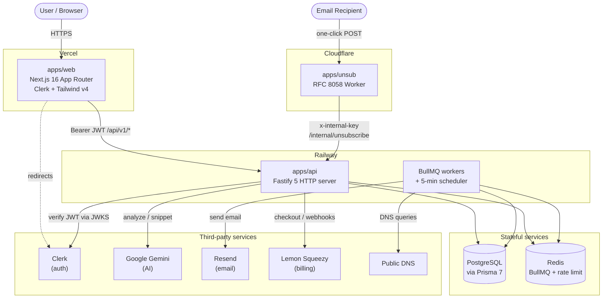

# InboxRules

Email deliverability monitoring SaaS. InboxRules checks a customer's sending domains for SPF/DKIM/DMARC and RFC 8058 one-click-unsubscribe compliance, uses AI (Google Gemini) to explain problems and generate configuration fixes in plain English, and hosts an RFC 8058 one-click unsubscribe endpoint at the edge.

---

## Table of Contents

- [Key Features](#key-features)
- [Architecture](#architecture)
- [Tech Stack](#tech-stack)
- [Repository Structure](#repository-structure)
- [Prerequisites](#prerequisites)
- [Installation](#installation)
- [Environment Variables](#environment-variables)
- [Running Locally](#running-locally)
- [Database Setup](#database-setup)
- [Background Workers](#background-workers)
- [Authentication](#authentication)
- [Multi-Tenancy](#multi-tenancy)
- [API Overview](#api-overview)
- [AI Architecture](#ai-architecture)
- [Deployment](#deployment)
- [Testing](#testing)
- [Linting & Type-Checking](#linting--type-checking)
- [Contribution Guidelines](#contribution-guidelines)
- [License](#license)

---

## Key Features

- **Automated DNS monitoring** — SPF, DKIM, DMARC, BIMI, MTA-STS, and TLS-RPT checks, run on a schedule whose interval depends on the tenant's plan (free 24h / pro 6h / agency 1h).
- **Change detection & alerting** — detects DNS record changes between scans, classifies severity (critical/warning), and dispatches alerts over email, Slack, and generic webhooks.
- **AI-powered explanations** — Google Gemini (`gemini-2.0-flash`) generates plain-English explanations of DNS issues and ESP-specific configuration snippets, streamed to the client over SSE.
- **One-click unsubscribe hosting** — a Cloudflare Worker serves an RFC 8058 (`List-Unsubscribe`/`List-Unsubscribe-Post`) one-click unsubscribe endpoint at the edge.
- **Multi-tenant** — every record is scoped to a `Tenant`; most models support soft-delete via `deletedAt`.
- **Plan-based quotas** — per-plan domain limits, polling frequency, and monthly AI spend budgets.

## Architecture

Three independently deployable apps in one pnpm workspace:



**Request flow (backend):** `routes → service → db/external`. Routes handle HTTP concerns only (Zod validation, status codes, error shaping); business logic lives in sibling `*.service.ts` files.

## Tech Stack

| Layer | Technology |
|-------|-----------|
| **Monorepo** | pnpm workspaces (`pnpm@10.33.0`) |
| **Backend** (`apps/api`) | Fastify 5, Prisma 7 (`engineType="client"` + `@prisma/adapter-pg`), BullMQ 5, ioredis, TypeScript, `tsx` (dev), Zod |
| **Frontend** (`apps/web`) | Next.js 16.2.6 (App Router, Turbopack), React 19, Clerk, Tailwind CSS v4, shadcn-style UI |
| **Edge** (`apps/unsub`) | Cloudflare Workers, Wrangler |
| **Database** | PostgreSQL (via Prisma driver adapter) |
| **Queue / cache** | Redis (BullMQ queues + Fastify rate-limit store) |
| **Auth** | Clerk (JWT verified server-side via JWKS with `jose`) |
| **AI** | Google Gemini `gemini-3.5-flash` (`@google/genai`) |
| **Email** | Resend |
| **Billing** | Lemon Squeezy |

## Repository Structure

```
InboxRules/
├── apps/
│   ├── api/                    # Fastify + Prisma + BullMQ backend (Railway)
│   │   ├── prisma/
│   │   │   ├── schema.prisma   # 10 models, provider postgresql
│   │   │   └── migrations/     # SQL migrations
│   │   ├── src/
│   │   │   ├── server.ts       # Fastify entry point
│   │   │   ├── db.ts           # Shared Prisma client (driver adapter)
│   │   │   ├── queue.ts        # BullMQ queue definitions
│   │   │   ├── middleware/     # auth.ts (Clerk JWKS)
│   │   │   ├── modules/        # domains, ai, alerts, billing, analytics,
│   │   │   │                   #   suppression, dns-checker
│   │   │   └── workers/        # dns-poll, alert-dispatch, scheduler
│   │   ├── docker-compose.yml  # Local Redis
│   │   └── package.json
│   ├── web/                    # Next.js dashboard (Vercel)
│   │   ├── app/                # App Router routes
│   │   ├── components/         # UI + dashboard components
│   │   ├── lib/                # API client hooks
│   │   ├── middleware.ts       # Clerk route protection
│   │   └── package.json
│   └── unsub/                  # Cloudflare Worker (RFC 8058)
│       ├── src/index.ts
│       ├── wrangler.toml
│       └── package.json
├── pnpm-workspace.yaml         # packages: ["apps/*"]
├── package.json                # Root (no build/test orchestration)
└── CLAUDE.md
```

There is no shared `packages/` directory. Each app has its own `package.json`; run commands from inside the app directory.

> Note: a stray `web/.next/` build-output directory exists at the repo root. It is **not** an app — the real frontend is `apps/web`.

## Prerequisites

- **Node.js** — a version compatible with Next.js 16 / React 19 and Prisma 7 (Node 20+ recommended).
- **pnpm** `10.33.0` (declared as `packageManager` in the root `package.json`).
- **PostgreSQL** database (connection string via `DATABASE_URL`).
- **Redis** (local via Docker Compose, or a hosted provider such as Upstash).
- Accounts / API keys for the external services you intend to exercise: Clerk, Google Gemini, Resend, Lemon Squeezy.

## Installation

```bash
# From the repo root
pnpm install
```

This installs dependencies for all workspace apps. Generate the Prisma client before running the API (see [Database Setup](#database-setup)).

## Environment Variables

Secrets must **never** be committed. Set values via each app's `.env` (API), `.env.local` (web), or `wrangler secret put` (unsub). The following are the variable **names** in use — see [DOCUMENTATION.md](./DOCUMENTATION.md#configuration-reference) for a per-variable reference.

### `apps/api` (`.env`)

```dotenv
# Core
DATABASE_URL="..."
REDIS_URL="..."
PORT="4500"
NODE_ENV="..."
FRONTEND_URL="..."
RUN_WORKERS_INLINE="..."   # gate: run workers in the HTTP process (default off)

# Clerk
CLERK_PUBLISHABLE_KEY="..."
CLERK_SECRET_KEY="..."
CLERK_WEBHOOK_SECRET="..."
CLERK_JWKS_URL="..."
CLERK_DOMAIN="..."

# AI / email
GEMINI_API_KEY="..."
RESEND_API_KEY="..."
RESEND_FROM_EMAIL="..."

# Billing (Lemon Squeezy)
LEMON_SQUEEZY_API_KEY="..."
LEMON_SQUEEZY_STORE_ID="..."
LEMON_SQUEEZY_WEBHOOK_SECRET="..."
LS_PRO_VARIANT_ID="..."
LS_AGENCY_VARIANT_ID="..."

# Unsubscribe link / internal auth
UNSUB_HMAC_SECRET="..."     # must be >= 32 chars, and match apps/unsub
UNSUB_WORKER_URL="..."
INTERNAL_API_KEY="..."      # must match apps/unsub
```

### `apps/web` (`.env.local`)

```dotenv
NEXT_PUBLIC_API_URL="..."   # default http://localhost:4500
CLERK_SECRET_KEY="..."
NEXT_PUBLIC_CLERK_PUBLISHABLE_KEY="..."
NEXT_PUBLIC_CLERK_SIGN_IN_URL="..."
NEXT_PUBLIC_CLERK_SIGN_UP_URL="..."
NEXT_PUBLIC_CLERK_AFTER_SIGN_IN_URL="..."
NEXT_PUBLIC_CLERK_AFTER_SIGN_UP_URL="..."
```

### `apps/unsub` (Wrangler secrets + vars)

`wrangler.toml` sets `ENVIRONMENT`; the following are set as secrets via `wrangler secret put` and are **never** stored in the file:

```
UNSUB_HMAC_SECRET   # must match apps/api
INTERNAL_API_KEY    # must match apps/api
API_URL             # base URL of apps/api
```

## Running Locally

Each app is run independently from its own directory.

**1. Start Redis** (from `apps/api`):

```bash
docker compose up -d          # redis:7-alpine on host port 6380
```

**2. Start the API** (from `apps/api`):

```bash
pnpm dev            # HTTP server (tsx watch src/server.ts)
```

Workers do **not** run by default. To process background jobs, either run them as a
separate process (recommended):

```bash
pnpm workers        # workers only (tsx watch src/workers/index.ts)
```

or set `RUN_WORKERS_INLINE=true` to start them inside the `pnpm dev` process.

**3. Start the web dashboard** (from `apps/web`):

```bash
pnpm dev            # next dev (Turbopack)
```

**4. (Optional) Start the unsubscribe worker** (from `apps/unsub`):

```bash
pnpm dev            # wrangler dev src/index.ts
```

By default the API listens on port `4500` and the web app calls it via `NEXT_PUBLIC_API_URL`.

## Database Setup

The backend uses Prisma 7 with `engineType="client"`, which **requires** the `@prisma/adapter-pg` driver adapter (configured in `src/db.ts`). Prisma 7 does not auto-load `.env`, so all `db:*` scripts run through `dotenv -e .env`.

From `apps/api`:

```bash
pnpm db:generate    # prisma generate — run after editing schema.prisma
pnpm db:migrate     # prisma migrate dev
pnpm db:push        # prisma db push
pnpm db:studio      # prisma studio
```

The schema defines 10 models (`Tenant`, `User`, `Domain`, `DnsSnapshot`, `DnsChangeEvent`, `EmailAnalysis`, `SuppressionEvent`, `UnsubscribeToken`, `AiUsageLog`, `AuditLog`). See [DOCUMENTATION.md](./DOCUMENTATION.md#database-architecture) for the full data model.

## Background Workers

Background processing runs on **BullMQ** backed by Redis. Two queues are defined in `src/queue.ts`:

- **`dns-poll`** — runs a DNS scan for a domain and detects changes (worker concurrency 5).
- **`alert-dispatch`** — sends notifications for unresolved change events (worker concurrency 2).

A **scheduler** (`src/workers/scheduler.ts`) runs on a 5-minute `setInterval`. It finds domains due for a rescan based on plan tier and enqueues `dns-poll` jobs with a deterministic `jobId` so BullMQ deduplicates. The weekly report send is piggybacked on the same interval (Monday morning check).

Running the workers inside the HTTP process is gated by `RUN_WORKERS_INLINE` (default **off**): `pnpm dev` starts only the HTTP server unless `RUN_WORKERS_INLINE=true` is set. To process jobs, run the workers as a separate process with `pnpm workers` (`src/workers/index.ts`) — which is also how they are intended to run in production.

## Authentication

Two distinct mechanisms:

- **User-facing routes** (`/api/v1/*`) sit behind `authMiddleware`, which verifies a **Clerk JWT** using Clerk's JWKS endpoint (via the `jose` library — no Clerk SDK), looks up the local `User` by `clerkId`, and attaches `request.tenantId` / `request.userId`. Every downstream service is scoped by `tenantId`.
- **Internal machine-to-machine routes** (e.g. `POST /internal/unsubscribe`, called by the unsub worker) authenticate with a static `x-internal-key` header compared against `INTERNAL_API_KEY` using a timing-safe comparison.

Webhook routes (billing, Clerk) are mounted outside the `/api/v1` scope and verify provider signatures instead. The frontend uses Clerk middleware (`middleware.ts`) to protect all routes except the public landing/auth/info pages.

## Multi-Tenancy

Every record is rooted at a `Tenant`. Almost every model carries a `tenantId`, and most support **soft-delete** via a `deletedAt` timestamp (queries filter `deletedAt: null`). Tenant isolation is enforced at the service layer: `authMiddleware` resolves the caller's `tenantId` and all queries are scoped to it. A partial unique index on `domains(tenantId, domain) WHERE deletedAt IS NULL` allows a soft-deleted domain to be re-added later.

## API Overview

The API is mounted under `/api/v1` (Clerk-authenticated), plus public webhook routes and one internal route. High-level groups:

| Group | Base path | Purpose |
|-------|-----------|---------|
| Domains | `/api/v1/domains` | CRUD, on-demand scans, unsubscribe enable/disable, unsubscribe headers |
| AI | `/api/v1/ai` | `POST /analyze` (SSE), `POST /snippet` |
| Suppression | `/api/v1/suppression` | List suppression events |
| Alerts | `/api/v1/alerts` | List/get/acknowledge/resolve change events; notification channels |
| Billing | `/api/v1/billing` | Plan info, checkout, portal, usage |
| Analytics | `/api/v1/analytics` | Health history, overview, compliance summary |
| Health | `GET /health` | Liveness check (public) |
| Webhooks | `POST /webhooks/billing`, `POST /webhooks/clerk` | Provider webhooks (signature-verified, public) |
| Internal | `POST /internal/unsubscribe` | Called by the unsub worker (`x-internal-key`) |

See [DOCUMENTATION.md](./DOCUMENTATION.md#api-endpoint-reference) for the full endpoint reference including query parameters and status codes.

## AI Architecture

AI features wrap Google Gemini (`gemini-2.0-flash`) via `@google/genai` behind a shared system instruction. Key properties:

- **Structured-data-only prompts** — the DNS checker only ever emits structured data; raw DNS strings and email headers are never fed into prompts (prompt-injection boundary).
- **Streaming** — `/ai/analyze` streams tokens to the client over Server-Sent Events (`dns_result` / `ai_token` / `done` / `error`).
- **Per-tenant monthly quota** — every call checks a monthly USD budget (free / pro / agency) against summed `AiUsageLog.costUsd` before proceeding; exceeding it returns HTTP 429.
- **Template-first snippets** — configuration snippets use built-in templates for known ESPs and only fall back to AI generation when no template matches.

## Deployment

| App | Target | Notes |
|-----|--------|-------|
| `apps/web` | **Vercel** | Next.js 16 App Router (Turbopack). No `vercel.json`/`vercel.ts` present — deployed with framework defaults. |
| `apps/api` | **Railway** | Fastify server (`pnpm start` → `node dist/server.js`, after `tsc`). Workers intended to run as a separate service (`pnpm workers`). |
| `apps/unsub` | **Cloudflare Workers** | Deployed via `pnpm deploy` (`wrangler deploy`). Secrets set with `wrangler secret put`. |

Production requires provisioned PostgreSQL and Redis, plus configured Clerk, Gemini, Resend, and Lemon Squeezy credentials. See [DOCUMENTATION.md](./DOCUMENTATION.md#deployment-topology) for the full topology.

## Testing

There is **no automated test suite** in the repository. `apps/api` includes an ad-hoc DNS check script:

```bash
# apps/api
pnpm test:dns       # tsx src/test-dns.ts — manual DNS check helper
```

The root `package.json` `test` script is a placeholder (`echo "Error: no test specified" && exit 1`).

## Linting & Type-Checking

```bash
# apps/web
pnpm lint           # eslint (Next.js config)
pnpm build          # next build (also runs TypeScript checking)

# apps/api — no build script; type-check/compile with tsc directly
npx tsc             # compiles to dist/ per tsconfig (outDir: ./dist)
```

The web app's production build (`pnpm build` → `next build`) runs TypeScript checking. `apps/api` has **no** `build`/`lint` script: it is compiled with `tsc` (which emits to `dist/`, matching the `start` script's `node dist/server.js`). There is no ESLint configuration in `apps/api`.

## Contribution Guidelines

No formal `CONTRIBUTING.md` exists in the repository. Conventions inferred from the codebase:

- **Run commands per-app** from inside each app directory; there is no root-level build/test orchestration.
- **Backend layering** — keep HTTP concerns in `*.routes.ts` and business logic in `*.service.ts`.
- **Preserve tenant isolation** — always scope queries by `tenantId`.
- **Keep the DNS→AI boundary** — never feed raw DNS records or email headers into AI prompts; pass only structured data.
- **After editing `schema.prisma`**, run `pnpm db:generate`. Define both sides of every Prisma relation.
- **Never commit secrets** — use `.env` / `.env.local` / `wrangler secret put`.

## License

The root `package.json` declares `"license": "ISC"`. No `LICENSE` file is present in the repository.
